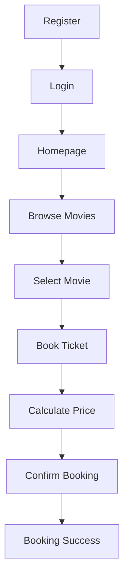

# 🎬 Movie Ticket Booking System

A responsive and interactive web application that simplifies the movie ticket booking process. Users can register, log in, browse available movies, calculate ticket costs, and book tickets through an intuitive and mobile-friendly interface.

---

## 🌐 Live Demo

🔗 **Website:**  
https://amlanshanker.github.io/Movie-ticket-booking-system/

---

## 📖 Project Overview

The Movie Ticket Booking System is designed to provide a seamless and convenient online movie reservation experience. Instead of waiting in long queues at theaters, users can browse movie listings, check show timings, and reserve tickets from anywhere.


---

## 🚀 Features

### 👤 User Management
- User Registration
- User Login
- Logout Functionality
- Username Persistence using Local Storage

### 🎥 Movie Browsing
- View Available Movies
- Display Movie Genre
- Display Duration
- Show Available Timings
- Display Ticket Prices

### 🎟 Ticket Booking
- Select Preferred Movie
- Choose Show Date
- Choose Show Timing
- Select Number of Tickets
- Automatic Ticket Price Calculation
- Booking Confirmation Popup

### 📱 Responsive Design
- Mobile-Friendly Interface
- Tablet Support
- Desktop Compatibility
- Responsive Layout using CSS Media Queries

### ⚡ Interactive Features
- JavaScript Event Handling
- Dynamic Price Updates
- Modal Popups
- Countdown Timer
- Local Storage API Integration

---

## 🛠 Technologies Used

| Technology | Purpose |
|------------|---------|
| 🌐 HTML5 | Structured web pages using semantic elements |
| 🎨 CSS3 | Responsive design and user interface styling |
| ⚡ JavaScript | Client-side interactivity and dynamic content |
| 💾 Local Storage API | Temporary storage of user information in the browser |
| 🚀 GitHub Pages | Project hosting and deployment |

## 📂 Project Structure

```text
Movie-Ticket-Booking-System/
│
├── index.html          # Registration Page
├── Login.html          # Login Page
├── Homepage.html       # Home Page
├── Booking.html        # Movie Listing Page
├── BookTicket.html     # Ticket Booking Page
├── About Us.html       # About Page
└── README.md           # Project Documentation
```

---

## 🔄 Application Workflow


